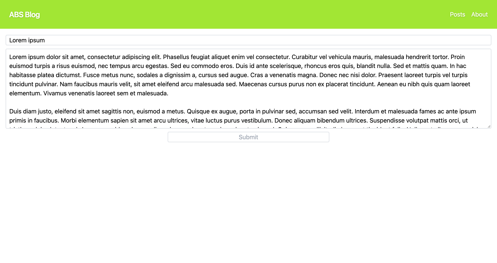

# Yet Another Shitty Blog

I created this spaghetti of code for one of my classes. Just a basic app with CRUD functionality.

## Installation

---

1. Install packages.

```bash
yarn
```

2. Create a MongoDB instance and add the connection URI to .env file.

## Usage

---

```bash
yarn start
```

and pray.

## Screenshots



